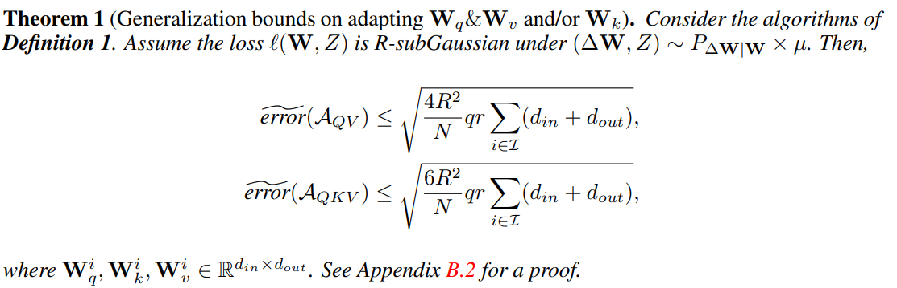
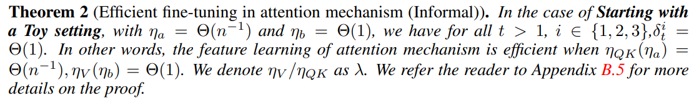
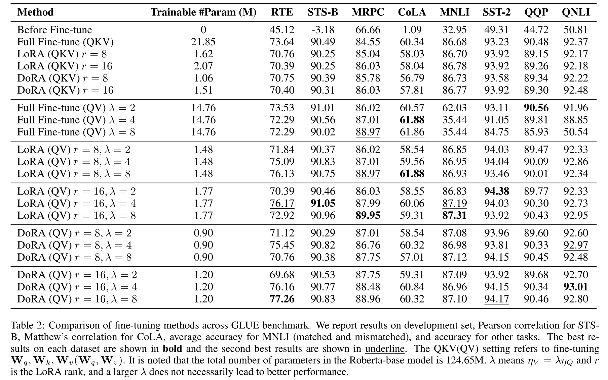

# RUC & Xiaomi: Efficient Fine-Tuning 🙌🎉

## 📰 News

- 2025-3-31: Delivery of a Prototype System for Parameter-Efficient and Gradient Projection Methods: A Comprehensive Benchmark Against 10+ State-of-the-Art Efficient Fine-Tuning Approaches.
- 2024-12-30: Theoretical Insights into Fine-Tuning Attention Mechanism.

## 🎯 Introduction and Target

(1) **Our insights** ([paper](https://arxiv.org/abs/2410.02247), in progress):

According to the traditional statistical learning viewpoint, performance can be defined by the sum of optimization error and generalization error. In (generalization, storage-friendly), we give **Theorem 1** (Information-theoretic genralization bounds), showing that with the same $r$ value, fine-tuning $\mathbf{W}_q,\mathbf{W}_v$ consistently achieves results comparable to or even surpassing those of fine-tuning $\mathbf{W}_q,\mathbf{W}_k,\mathbf{W}_v$. This reduces the number of parameters for the same $r$, while improving generalization bounds and potentially providing memory benefits. In (optimization, time-friendly), we discuss the learning dynamics in fine-tuning attention mechanism, and we illustrate **Theorem 2** that the feature learning of attention mechanism is efficient when the learning rate for $\mathbf{W}_v$ should be generally much larger than that of $\mathbf{W}_q,\mathbf{W}_k$ in fine-tuning. Building on our experimental and theoretical insights, one can develop new algorithms to improve the effectiveness (e.g., storage, and time) of fine-tuning.





(2) **Target:**

$\text{\textcolor{blue}{This project conducts comprehensive benchmarking of the following 10+ efficient fine-tuning methods.}}$

**Notably, our proposed approach maintains orthogonal compatibility and can be synergistically combined with any of these methods.**

## 📖 10+ efficient fine-tuning methods

- [LoRA](https://openreview.net/forum?id=nZeVKeeFYf9) (ICLR 2022)
- [AdaLoRA](https://openreview.net/forum?id=lq62uWRJjiY) (ICLR 2023)
- [DoRA](https://arxiv.org/abs/2402.09353) (ICML Oral)
- [PiSSA](https://openreview.net/forum?id=6ZBHIEtdP4) (NeurIPS 2024)
- [rsLoRA](https://arxiv.org/abs/2312.03732)
- [OLoRA](https://arxiv.org/abs/2406.01775)
- [EVA](https://arxiv.org/abs/2410.07170)
- [IA3](https://arxiv.org/abs/2205.05638)
- [SIFT](https://arxiv.org/abs/2312.11875) (ICML 2024)
- [Galore](https://arxiv.org/abs/2403.03507) (ICML 2024 Oral)

## ⚙️ Install

1. To install the experiment, please install the pip file.

```
pip install -r requirements.txt
```

2. (Optional) For SIFT&Galore

```
git clone git@github.com:song-wx/SIFT.git
cd SIFT
pip install .
```

```
pip install galore-torch
```

## 🚀 Quick Start

### Get Dataset

```bash
data_download.py
```

### Usage

1. ensure execute permissions

   ```
   chmod +x xxx.sh  #xxx->your file name
   ```

2. Full-Finetuning, LoRA, AdaLoRA, DoRa, PiSSA, rsLoRA, OLoRA, EVA, SIFT

   ```
   # choose the target method_name and modules.
   EfficientFT/sh/roberta-base-peft.sh 
   EfficientFT/sh/llama-peft.sh
   ```

3. Galore.

   ```
   EfficientFT/sh/roberta_galore.sh
   ```

## 😊Some Results



## 📝 Citation

```bibtex
@misc{yao2024theoreticalinsightsfinetuningattention,
      title={Theoretical Insights into Fine-Tuning Attention Mechanism: Generalization and Optimization}, 
      author={Xinhao Yao et al.},
      year={2024},
      eprint={2410.02247},
      archivePrefix={arXiv},
      primaryClass={cs.LG},
      url={https://arxiv.org/abs/2410.02247}, 
}
```
